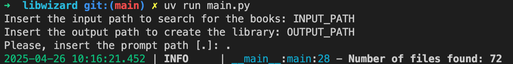

I always download a lot of ebooks that are saved to my /Downloads folder. In order to create an organized library I developed this Python script that reads all .pdf files in the Downloads folders and generetas a folder with the ebooks organized by category.

To be able to organize the data the OpenAI API was used to extract, from the ebook's title, the category and the title of it. The following prompt was used:

```markdown
You are a helpfull assistant that will help me to organize my books to generate a library.

I will pass to you a file name and you must define a category and a sub-category and extract the book's name.

The category and sub-category must respect pre-defined hierarchy, specified by the following dictionary:

{{
    Data science: Credit risk, NLP, Deep learning, Causal inference, Machine learning, Time series, Feature engineering, Data visualization, Marketing,
    Data engineering: Data engineering, Data pipelines, Data warehouse,
    Graphs: Graphs, Neo4j, Tigergraph,
    Databases: Databases, Kibana, Elastic search, PostgreSQL, SQL,
    Programming: Haskell, Python, Javascript, Functional programming,
    Cloud: AWS, Kubernetes, Docker
    Big data: Spark, Airflow, Flink, Data lake, Trino, MapReduce
    Streaming: Streaming, Kafka,
}}

The key is the category and the values are the allowed sub-categories.

You must follow the defined hierarchy.

File name: {name}.

Pay attention to this file name, since all the information that you need is stored in it.

Try to extract the full book's name.

Please, return the output as a JSON object.

In the JSON the title of the book must have the key title, the category must have the key category and the sub-category must have the key sub-category.

If you think that the file is not a book add a filed called book and set it to false in the output json.

And always respect this format.
```

With this prompt the script generates an output like this:

```json
{
    "title": "EXTRACTED_TITLE",
    "category": "EXTRACTED_CATEGORY",
    "sub-category": "EXTRACTED_SUB_CATEGORY",
    "original_title": "ORIGINAL_TITLE"
}
```

This structure is used to generate a folder with all ebooks organized by category and sub-category.

Is worth to mention that a BACKUP folder is used to maintain a backup of all ebooks.

# How to use

To use the script you need to run ``uv run main.py``:



The script will ask for the input path (where to look for the ebooks) and output path (where to save the libray).

You also need to pass the prompt path (if you want to use a customized prompt).